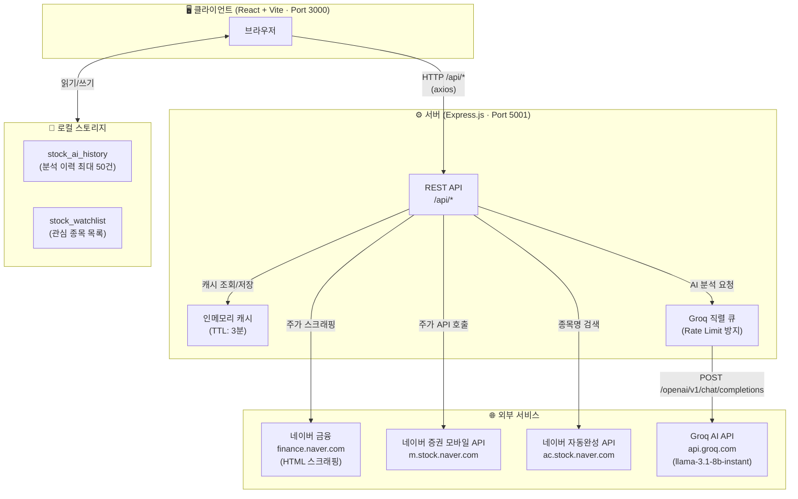
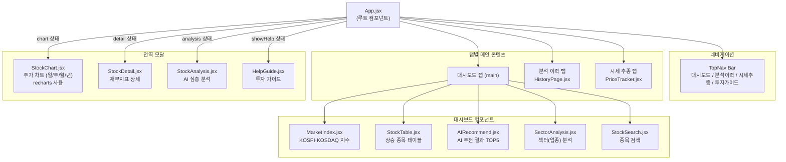
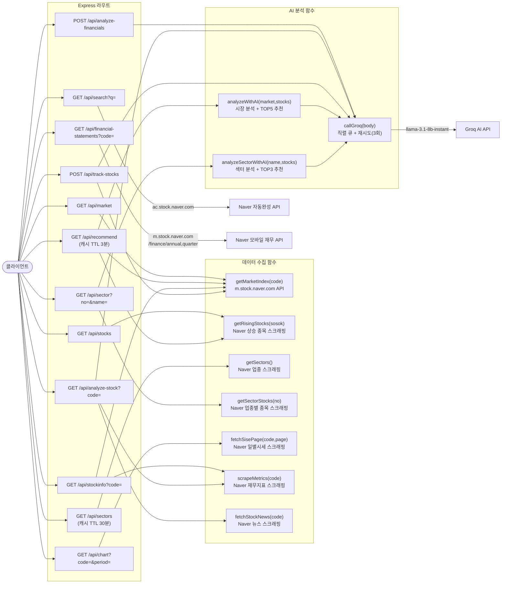
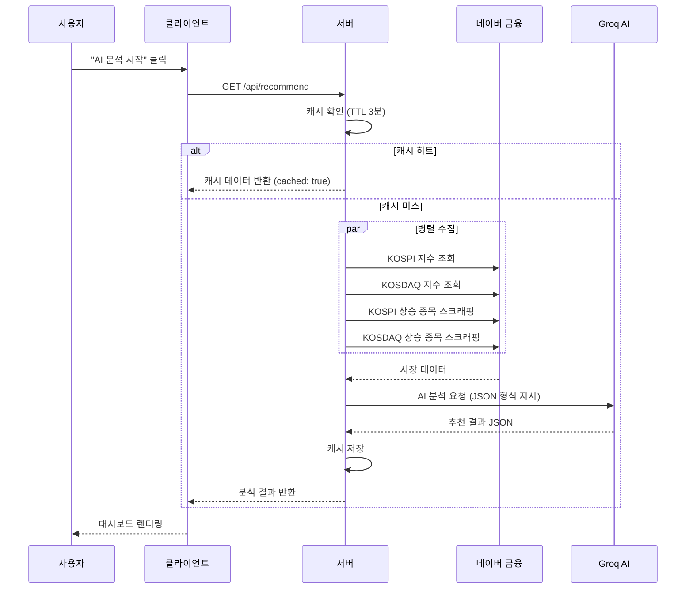
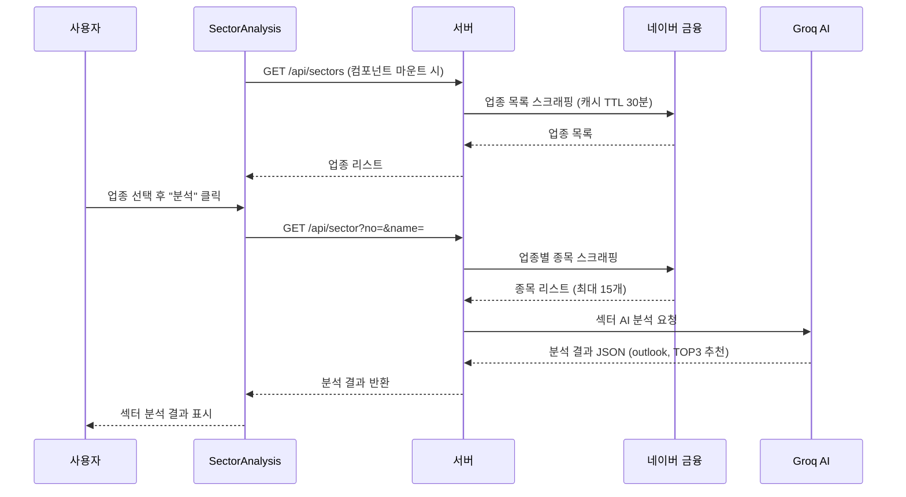
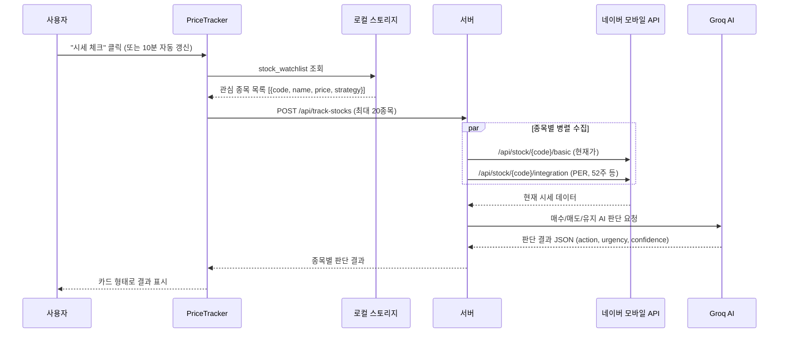
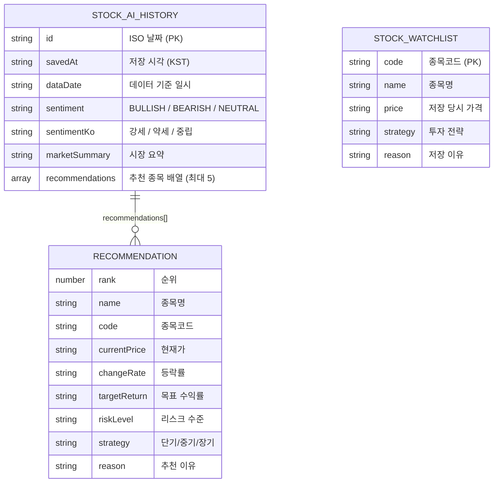

# InsightLedger AI — 아키텍처 뷰

> 본 문서는 `stock-agent` 프로젝트의 실행 구조를 다이어그램으로 정리한 아키텍처 뷰입니다.

---

## 1. 전체 시스템 아키텍처

---

## 2. 클라이언트 컴포넌트 계층 구조

---

## 3. 서버 API 라우트 및 데이터 흐름

---

## 4. 주요 기능별 시퀀스 다이어그램

### 4-1. AI 추천 분석 (`🤖 AI 분석 시작` 버튼)

### 4-2. 섹터 분석

### 4-3. 시세 추종 (관심 종목 추적)

---

## 5. 데이터 저장 구조 (로컬 스토리지)

---

## 6. 기술 스택 요약

| 구분 | 기술 | 역할 |
|---|---|---|
| **프론트엔드** | React 18 + Vite 5 | UI 렌더링 |
| **차트** | Recharts 3 | 주가 차트 (가격·거래량) |
| **HTTP 클라이언트** | Axios | API 요청 (클라이언트·서버 공통) |
| **백엔드** | Node.js + Express 4 | REST API 서버 |
| **HTML 파싱** | Cheerio | 네이버 금융 스크래핑 |
| **인코딩** | iconv-lite | EUC-KR → UTF-8 변환 |
| **AI 모델** | Groq (llama-3.1-8b-instant) | 시장 분석·종목 추천 |
| **상태 관리** | React useState / useEffect | 컴포넌트 로컬 상태 |
| **영구 저장** | Browser LocalStorage | 분석 이력·관심 종목 |
| **프록시** | Vite dev proxy | `/api` → `localhost:5001` |
